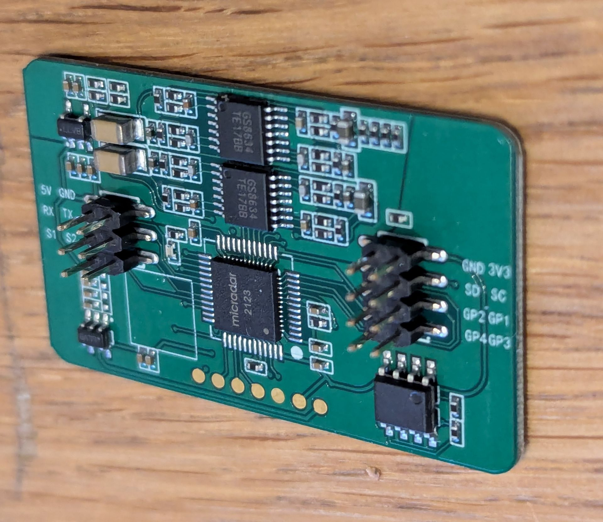
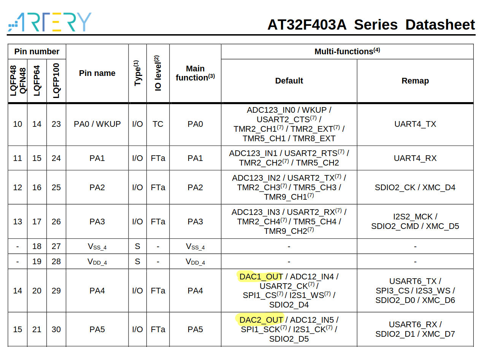
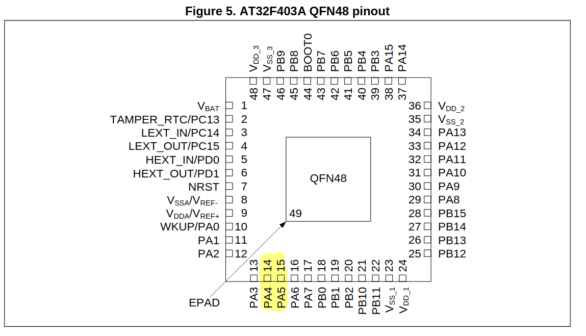
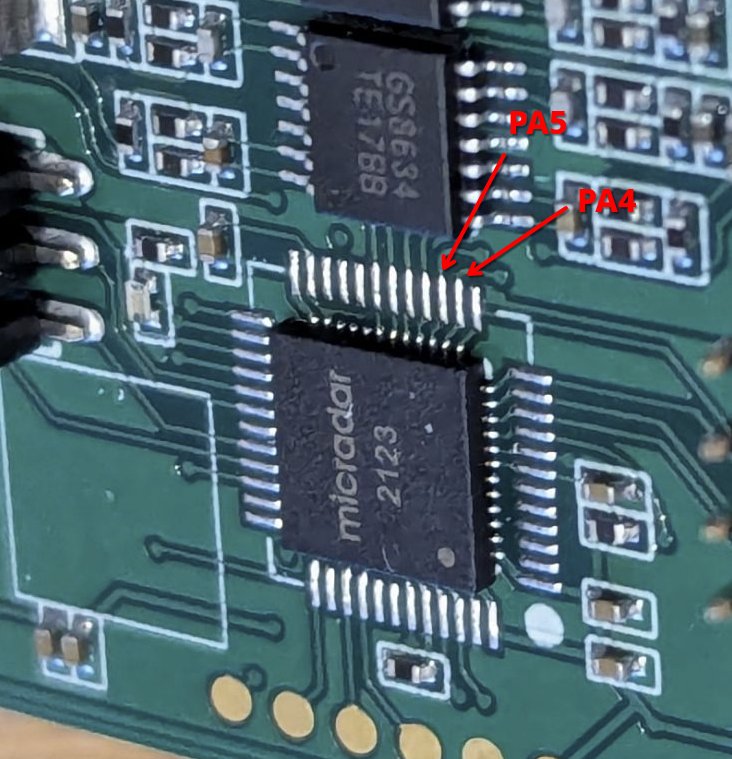

# The MicRadar R24BBD1

The R24BBD1 is a FMCW radar based on the SGRSemi SRK1101 and Artery AT32F403ACGU7.

It can be bought for ~10-15€ from Aliexpress or other Chinese websites.

The big question: is the DAC of the microcontroller connected to the FMCW chip so we recycle this platform as a radar experimental platform? 

Short: No. It's a CW radar board without the frequency modulation part.

# Extracting the firmware

As no firmware is available and the microcontroller is rather exotic this is a bit more complicated. But thanks to the internet some people ported OpenOCD for it, sadly this never was mainlined and ended up in orphaned forks.

1. Get the OpenOCD from from [Here](https://github.com/dron0gus/openocd/tree/b58982828305d681702a80202466d2d48498d039). Be careful: you must use the "artery-dev" branch.

2. Get the startup scripts from [here](https://github.com/dron0gus/ChibiOS/tree/b40aca04c4e5d1c53bb53cdd96066947a3087d2b/demos/STM32/RT-AT32F435-ARTERY144)

3. Pin configuration for the ST-Link was found by this [dude](https://github.com/marcnewlin/human-detector-detector)

Combining both OpenOCD can connect to it without yelling at invalid identification registers.

```
# openocd  -f ./tcl/interface/stlink.cfg  -f  at32f4x.cfg 
Open On-Chip Debugger 0.12.0+dev-g85a149476 (2025-01-03-12:49)
Licensed under GNU GPL v2
For bug reports, read
        http://openocd.org/doc/doxygen/bugs.html
Info : auto-selecting first available session transport "hla_swd". To override use 'transport select <transport>'.
Info : The selected transport took over low-level target control. The results might differ compared to plain JTAG/SWD
Info : Listening on port 6666 for tcl connections
Info : Listening on port 4444 for telnet connections
Info : clock speed 2000 kHz
Info : STLINK V2J39S7 (API v2) VID:PID 0483:3748
Info : Target voltage: 3.252277
Info : [at32f4x.cpu] Cortex-M4 r0p1 processor detected
Info : [at32f4x.cpu] target has 6 breakpoints, 4 watchpoints
Info : starting gdb server for at32f4x.cpu on 3333
Info : Listening on port 3333 for gdb connections
Info : accepting 'telnet' connection on tcp/4444
Info : Chip: AT32F403ACGU7, 1024kB FLASH, 2048 bytes sectors
```

Now attempt to dump the flash

```
> dump_image flash_dump.bin 0x08000000 0x100000  
dumped 1048576 bytes in 9.719759s (105.352 KiB/s)
```

Successful.

```
# sha256sum flash_dump.bin
222946ccb63fa82ed5df2e36d713391d619ac700eec77ac46671159c1ef079b4  flash_dump.bin
```

## Firmware Strings

Only looking for the interesting parts.

```
# strings  flash_dump.bin


printf_s: %n disallowed
printf: bad %n argument
printf_s: bad %s argument
constraint handler: bad message
(...)
D:\SYKJ\SY0105\SY105CodeForAT32\hal_proxy\src\flash_proxy.c
D:\SYKJ\SY0105\SY105CodeForAT32\freertos\tasks.c
[Debug]Assert failed: %s, line %u
printf_s: %n disallowed
printf: bad %n argument
printf_s: bad %s argument
 constraint handler: bad message
(...)
C:\Users\djzr5\Desktop\work\sy105\protocol\tuya_zigbee\src\tuya_zigbee_base_protocol.c
C:\Users\djzr5\Desktop\work\sy105\protocol\tuya_wifi\src\tuya_wifi_base_protocol.c
C:\Users\djzr5\Desktop\work\sy105\protocol\general\src\general_wifi_protocol.c
C:\Users\djzr5\Desktop\work\sy105\app\src\breath_count_detection_task.c
C:\Users\djzr5\Desktop\work\sy105\app\src\heart_count_detection_task.c
C:\Users\djzr5\Desktop\work\sy105\app\src\host_alarm_detection_task.c
C:\Users\djzr5\Desktop\work\sy105\app\src\memory_inf_read_and_write.c
C:\Users\djzr5\Desktop\work\sy105\app\src\sleep_state_judgment_task.c
C:\Users\djzr5\Desktop\work\sy105\app\src\adc_data_process_task.c
C:\Users\djzr5\Desktop\work\sy105\app\src\bh1710_detection_task.c
C:\Users\djzr5\Desktop\work\sy105\app\src\direction_judgment_task.c
C:\Users\djzr5\Desktop\work\sy105\app\src\dynamic_parameters_task.c
C:\Users\djzr5\Desktop\work\sy105\hal_proxy\src\encryption_proxy.c
C:\Users\djzr5\Desktop\work\sy105\app\src\heartbeat_packet_task.c
C:\Users\djzr5\Desktop\work\sy105\app\src\message_transmit_task.c
C:\Users\djzr5\Desktop\work\sy105\app\src\ota_result_report_task.c
C:\Users\djzr5\Desktop\work\sy105\app\src\self_inspection_task.c
C:\Users\djzr5\Desktop\work\sy105\app\src\somebody_judgment_task.c
abcdefghijklmnopqrstuvwxyzABCDEFGHIJKLMNOPQRSTUVWXYZ0123456789
C:\Users\djzr5\Desktop\work\sy105\app\src\fall_detection_task.c
C:\Users\djzr5\Desktop\work\sy105\hal_proxy\src\flash_proxy.c
C:\Users\djzr5\Desktop\work\sy105\freertos\portable\heap_4.c
C:\Users\djzr5\Desktop\work\sy105\app\src\iwdg_thread_guard.c
C:\Users\djzr5\Desktop\work\sy105\app\src\key_judgment_task.c
C:\Users\djzr5\Desktop\work\sy105\app\src\test_platform_task.c
C:\Users\djzr5\Desktop\work\sy105\hal_proxy\src\key_proxy.c
C:\Users\djzr5\Desktop\work\sy105\freertos\portable\port.c
C:\Users\djzr5\Desktop\work\sy105\freertos\stream_buffer.c
C:\Users\djzr5\Desktop\work\sy105\app\src\dn_led_task.c
C:\Users\djzr5\Desktop\work\sy105\app\src\start_task.c
C:\Users\djzr5\Desktop\work\sy105\freertos\queue.c
C:\Users\djzr5\Desktop\work\sy105\freertos\tasks.c
C:\Users\djzr5\Desktop\work\sy105\freertos\timers.c
C:\Users\djzr5\Desktop\work\sy105\user\common.c
Zone-0 Write password authentication failed
zone-%d read password authentication failed
zone-%d write password authentication failed
{"p":"q5tzbwkvhxwezlud","v":"1.1.6","m":0}
{"p":"q5tzbwkvhxwezlud","v":"1.1.6","m":0}
hold_breath_in_sleep_report_timer
[Debug]Assert failed: %s, line %u
{"p":"xoh6xwsj","v":"1.1.6","m":0}
{"p":"xoh6xwsj","v":"1.1.6","m":0}
 motion_direction_reset_timer
dn_led_state_delay_120s_timer
Zone-0 Authentication failed
Zone-0 Authentication failed.
Zone-1 Authentication failed.
Zone-2 Authentication failed.
Zone-3 Authentication failed.
suspected_fall_judgement_timer
breath_count_report_timer
breath_count_detection_task
dn_led_state_delay_5s_timer
Communication failure
VerifyPassword failure
set password0 failure
set password1 failure
set password2 failure
set password3 failure
set password4 failure
set password5 failure
set password6 failure
set password7 failure
real_fall_judgement_timer
heart_count_report_timer
heart_count_detection_task
host_alarm_detection_timer
host_alarm_detection_task
memory_inf_read_and_write
sleep_state_report_timer
nobody_to_somebody_timer
force_entry_nobody_timer
bh1710_detection_timer
bh1710_detection_task
direction_judgment_task
dynamic_parameters_task
set AR PR failure
Communication failure
cw0881_register failure
Cw0881_Check failure
heartbeat_packet_task
iwdg_thread_guard_task
message_transmit_task
ota_result_report_task
self_inspection_timer
self_inspection_task
motion_to_static_timer
static_to_nobody_timer
sustain_static_timer
(...)
set g0 failure
set g2 failure
set g3 failure
fall_detection_task
key_judgment_task
somebody_judgment
somebody_judgment
test_platform_task
 PAC %d %x
G24VD1SYV010105
adc_data_p
dn_led_task
%d %d %d
start_task
R24AVD1
R24A
IDLE
Tmr Svc
TmrQ
UD~3
R24AVD1
R24A
G24VD1SYV010106
{"p":"q5tzbwkvhxwezlud","v":"1.1.6","m":0}
``` 

Lots of debug symbols. I'm thankful - but nothing mentions the DAC :-(

Let's use Ghdira and the SVD file to check if there's any access going  to the DAC registers.

## Having a look at the DAC access using Ghdira

A compatible SVD file can be found on [this](https://github.com/vadrov/AT32F403ACGU7_clone_windows_desktop_virtual_com_port/tree/main/SVD) repository, this file can be loaded with
 Ghidra SVD.

Nope:

```
(...)

                             //
                             // DAC 
                             // Generated by Device Tree Blob
                             // ram:40007400-ram:400077ff
                             //
                             Peripherals::DAC
           40007400                 DAC_reg_t
           40007400                 ulong     ??                      CTRL          Control register (
           40007404                 ulong     ??                      SWTRG         DAC software trigg
           40007408                 ulong     ??                      D1DTH12R      DAC1 12-bit right-
           4000740c                 ulong     ??                      D1DTH12L      DAC1 12-bit left a
           40007410                 ulong     ??                      D1DTH8R       DAC1 8-bit right a
           40007414                 ulong     ??                      D2DTH12R      DAC2 12-bit right 
           40007418                 ulong     ??                      D2DTH12L      DAC2 12-bit left a
           4000741c                 ulong     ??                      D2DTH8R       DAC2 8-bit right-a
           40007420                 ulong     ??                      DDTH12R       Dual DAC 12-bit ri
           40007424                 ulong     ??                      DDTH12L       DUAL DAC 12-bit le
           40007428                 ulong     ??                      DDTH8R        DUAL DAC 8-bit rig
           4000742c                 ulong     ??                      D1ODT         DAC1 data output r
           40007430                 ulong     ??                      D2ODT         DAC2 data output r
(...)

```

No references to the DAC in the entire firmware blob.  

## Looking at the pins


Maybe there's one last hope that they just switch on a steady GPIO output for CW. Lets look which options are viable (DAC1_OUT, DAC2_OUT) for us.



So what is PA4 and PA5 doing on the board?



And matching this to the board



Poking it with a scope showed:
- PA5: looks like a high-pass filtered Echo signal
- PA4: steady signal around ~1.5V

As this microcontroller only supports 0V/3V3 logic 1.5V  on PA4 seems to come from the radar or analog part of the PCB. Guess it's also sampled by the ADC.

So no - we cannot set our own frequency modulation with this board :-(
